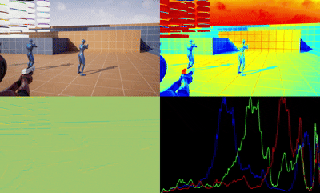

# Lyra Multi-Modal Gameplay Capture Plugin (Unreal Engine 5.5)

This repository contains a configurable Unreal Engine 5.5 plugin developed for the **Lyra Starter Game**. It captures gameplay videos composed of four synchronized visual modalities in a 2x2 grid per frame:
- **Top-Left:** RGB View  
- **Top-Right:** Depth View  
- **Bottom-Left:** Surface Normal View  
- **Bottom-Right:** RGB Intensity Histogram View  

The plugin allows flexible configuration through an external `.ini` file and is fully integrated with the Lyra project for Windows packaging.

---

## Example Recording


## 🧠 Purpose

The plugin is intended for generating **multi-modal datasets** from Lyra gameplay, useful for training AI/ML models on computer vision and scene understanding tasks.

---

## 🧩 Features

- 🔌 Unreal Engine **plugin-based** implementation.
- ⚙️ Configurable via external `.ini` file.
- 🎥 Captures videos with up to four view modalities.
- 🎮 Controlled using keyboard input to start/stop recording.
- 📁 Flexible **video file naming** and output directory.
- 🖼️ Inserts placeholder black views labeled **"Not Configured"** if a modality is disabled.

---

## 📁 Plugin Configuration (`.ini`)

The plugin reads its settings from an external `.ini` file. Example configuration:

```ini
[MultimodalCapture]
Include_Depth=True
Include_SurfaceNormal=True
Include_Histogram=True
Start_Capture_Key=F5
Stop_Capture_Key=F6
Videos_dir=C:/LyraCaptures
